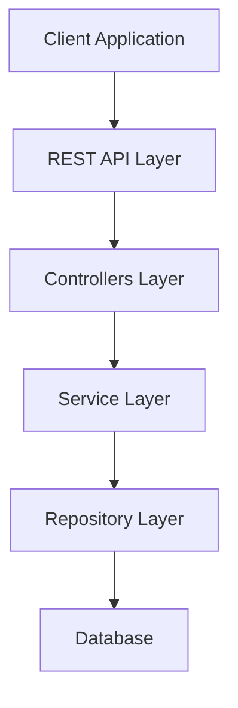
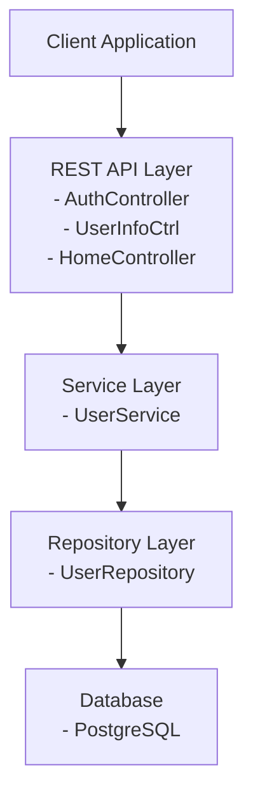
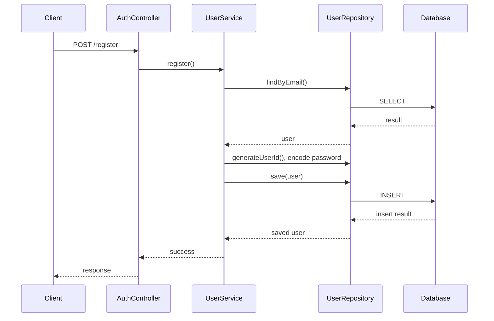
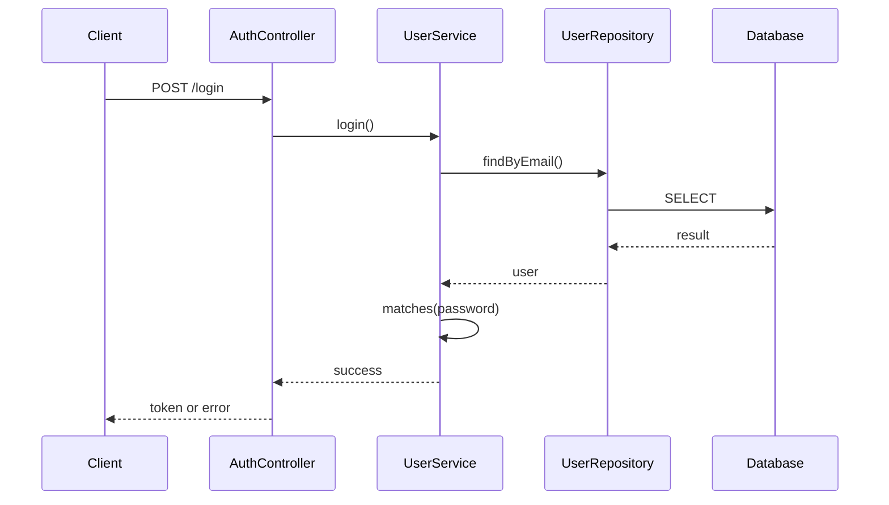
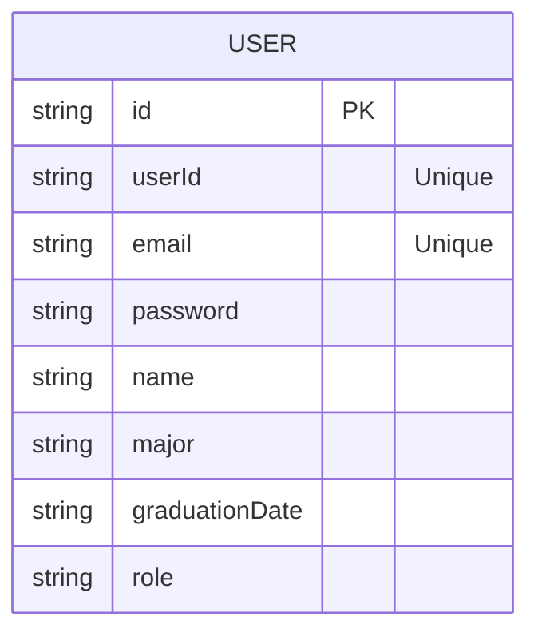

## 🧱 Component Diagram

### Basic Layered Architecture



---

### Detailed Component Diagram



---

## 🔁 Sequence Diagram: User Registration



---

## 🔐 Sequence Diagram: User Login



---

## 🧬 Entity-Relationship Diagram



---

## 🌐 API Endpoints Map

```mermaid
flowchart TD
    A[AuthAPI] --> B[Authentication]
    B --> B1[POST /api/auth/register]
    B --> B2[POST /api/auth/login]
    A --> C[User Management]
    C --> C1[GET /api/auth/userinfo]
    C --> C2[GET /api/auth/userinfo/{id}]
    C --> C3[POST /api/auth/userinfo]
    C --> C4[DELETE /api/auth/userinfo/{id}]
    C --> C5[POST /api/auth/userinfo/{id}]
```

---
